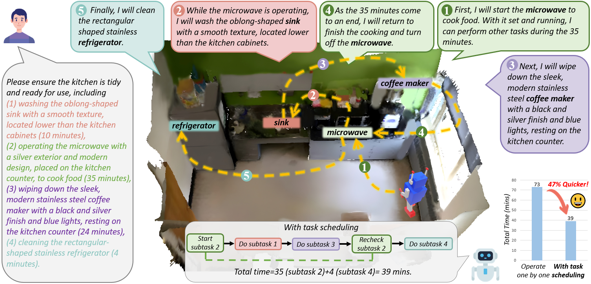
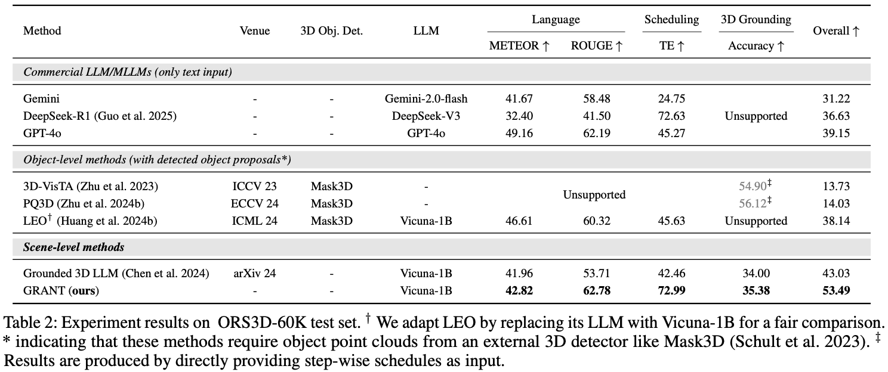

<div  align="left">    
 
</div>

<div align="center">
<h3>Cook and Clean Together: Teaching Embodied Agents for Parallel Task Execution</h3>
<div class="is-size-5 publication-authors">
    <span class="author-block">AAAI 2026 <strong><span style="color:red;">Oral</span></strong>
</div>

[Dingkang Liang](https://dk-liang.github.io/)<sup>1\*</sup>, [Cheng Zhang](https://zc2023.github.io/)<sup>1\*</sup>, [Xiaopeng Xu](https://github.com/x2-peng)<sup>1</sup>, Jianzhong Ju<sup>2</sup>, Zhenbo Luo<sup>2</sup>, [Xiang Bai](https://scholar.google.com/citations?user=UeltiQ4AAAAJ&hl=en)<sup>1</sup>

<sup>1</sup> Huazhong University of Science & Technology, <sup>2</sup> MiLM Plus, Xiaomi Inc.  

(\*) Equal contribution. 

[](https://arxiv.org/abs/2503.13587)
[](https://github.com/H-EmbodVis/GRANT)
[](https://huggingface.co/datasets/H-EmbodVis/ORS3D-60K)
[](https://github.com/tatsu-lab/stanford_alpaca/blob/main/LICENSE)

</div>

## 📣 News

- **[2025.11.8]** This work is accepted by AAAI2026 as **oral** presentation!


## Abstract

This repository contains the official implementation of “Cook and Clean Together: Teaching Embodied Agents for Parallel Task Execution”.

We introduce ORS3D, a task that unifies language understanding, 3D grounding, and efficiency-focused scheduling for embodied agents. To support this task, we build ORS3D-60K, a large-scale dataset with 60K task descriptions grounded in 4K real-world scenes.

We further propose GRANT, a multi-modal embodied LLM equipped with a lightweight scheduling token mechanism, enabling efficient stepwise planning and grounded action generation. Experiments on ORS3D-60K show that GRANT achieves strong performance across comprehension, grounding, and scheduling efficiency.
 <div  align="center">    
 
</div>


## 🛠️ Getting Started
This project is built upon [Grounded 3D-LLM](https://github.com/OpenRobotLab/Grounded_3D-LLM), and the preparations are rougly follow the Grounded 3D-LLM.

### Environment Setup

Python: `3.10.16`  
Pytorch: `1.12.1+cu116`  
CUDA: 11.6  

```
conda create -n GRANT python=3.10.16
conda activate GRANT

conda install openblas-devel -c anaconda
conda install openjdk=11

pip install -r requirements.txt

export LD_LIBRARY_PATH=/mnt/petrelfs/share/gcc/mpc-0.8.1/lib:/mnt/petrelfs/share/gcc/mpfr-2.4.2/lib:/mnt/petrelfs/share/gcc/gmp-4.3.2/lib:/mnt/petrelfs/share/gcc/gcc-9.4.0/lib64:$LD_LIBRARY_PATH

pip3 install torch==1.12.1+cu116 torchvision==0.13.1+cu116 --extra-index-url https://download.pytorch.org/whl/cu116
pip3 install torch-scatter -f https://data.pyg.org/whl/torch-1.12.1+cu116.html
pip install peft==0.8.2 --no-deps # ignore the pytorch version error 

cd third_party
git clone --recursive "https://github.com/NVIDIA/MinkowskiEngine"
cd MinkowskiEngine
git checkout 02fc608bea4c0549b0a7b00ca1bf15dee4a0b228
python setup.py install --blas_include_dirs=${CONDA_PREFIX}/include --blas=openblas

cd ../pointnet2
python setup.py install
```

> [!NOTE]  
> If you encounter version issues, please refer to the complete dependency list in `requirements.txt`.

### Data preparation
Download ORS3D-60K dataset and dataset splits from [HuggingFace](https://huggingface.co/datasets/H-EmbodVis/ORS3D-60K).  
Download 3D scenes from [SceneVerse](https://github.com/scene-verse/SceneVerse/blob/main/DATA.md).
```
GRANT
├── data                            
│   ├── langdata
│   │   │── ORS3D.json # ORS3D-60K dataset
│   │── SceneVerse
│   │   │── 3RScan
│   │   │── ARKitScenes
│   │   │── HM3D
│   │   │── MultiScan
│   │   │── ScanNet
│   │   │── splits # ORS3D-60K dataset splits
```


### Pretrained weights

#### 1, Download the pretrained LLM weights
Please download the pretrained LLM weights ([Tiny-Vicuna-1B](https://huggingface.co/Jiayi-Pan/Tiny-Vicuna-1B)) and store them in `$ROOT_PATH/pretrained/llm_weight/Tiny-Vicuna-1B/`

#### 2, Download the model weights
Download the point cloud encoder weights and pretrained GRANT weights from [HuggingFace](https://huggingface.co/H-EmbodVis/GRANT).

## Training

### Preparation
Put the pretrained weights of 3D encoder and LLM to the proper directory.
```
GRANT
│── pretrained                      
│   │── bert-base-uncased           
│   │── label_clip_features.pth     
│   │── pointcloud_encoder.ckpt 
│   │── GRANT.ckpt   
│   │── llm_weight
│   │   │── Tiny-Vicuna-1B        
```


Run the training command: `bash final_scripts/train.sh`

## Evaluation

Run the model evaluation command: `bash final_scripts/eval.sh`


## 📈 Main Results

<div  align="center">    
 
</div>

## Acknowledgement

This project is based on Grounded 3D-LLM ([paper](https://arxiv.org/abs/2405.10370), [code](https://github.com/OpenRobotLab/Grounded_3D-LLM), [page](https://groundedscenellm.github.io/grounded_3d-llm.github.io/)), SG3D ([paper](https://arxiv.org/abs/2408.04034), [code](https://github.com/sg-3d/sg3d), [page](https://sg-3d.github.io/)), LEO ([paper](https://arxiv.org/abs/2311.12871), [code](https://github.com/embodied-generalist/embodied-generalist), [page](https://embodied-generalist.github.io/)). Thanks for their wonderful works.

## Citation

If you find this repository useful in your research, please consider giving a star ⭐ and a citation.
```bibtex
@article{

}
```

