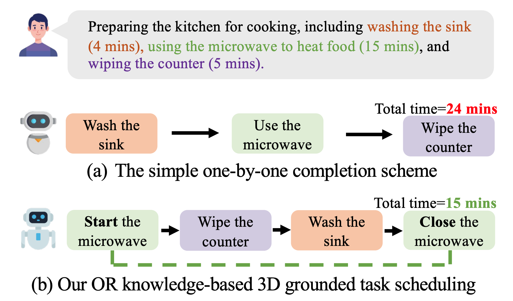
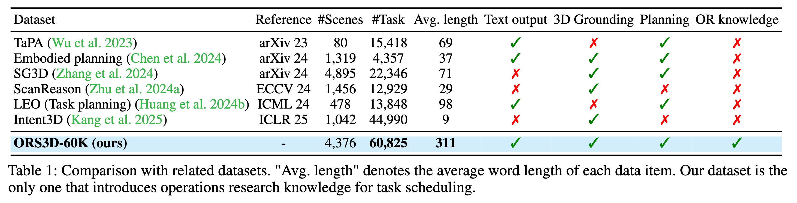

<div  align="left">    
 
</div>

<div align="center">
<h3>Cook and Clean Together: Teaching Embodied Agents for Parallel Task Execution</h3>
<div class="is-size-5 publication-authors">
    <span class="author-block">AAAI 2026 <strong><span style="color:red;">Oral </span></strong> 🎉 (acceptance rate ~4.5%)
</div>

[Dingkang Liang](https://dk-liang.github.io/)<sup>1\*</sup>, [Cheng Zhang](https://zc2023.github.io/)<sup>1\*</sup>, [Xiaopeng Xu](https://github.com/x2-peng)<sup>1</sup>, [Jianzhong Ju](https://scholar.google.com/citations?user=W1sZaQ0AAAAJ&hl=zh-CN)<sup>2</sup>, [Zhenbo Luo](https://scholar.google.com/citations?user=Sh6y-_EAAAAJ&hl=zh-CN)<sup>2</sup>, [Xiang Bai](https://scholar.google.com/citations?user=UeltiQ4AAAAJ&hl=en)<sup>1</sup>

<sup>1</sup> Huazhong University of Science & Technology, <sup>2</sup> MiLM Plus, Xiaomi Inc.  

(\*) Equal contribution. 

[](https://arxiv.org/abs/2511.19430)
[](https://h-embodvis.github.io/GRANT)
[](https://huggingface.co/datasets/H-EmbodVis/ORS3D-60K)
[](https://github.com/tatsu-lab/stanford_alpaca/blob/main/LICENSE)

</div>

## 📣 News

- **[2025.11.24]** The code and dataset are released.
- **[2025.11.08]** 🎉🎉🎉 This work is accepted by AAAI2026 as **<span style="color:red;">Oral</span>** presentation (acceptance rate ~4.5%)! 


## 📄 Abstract
 <div  align="center">    
 
</div>

Task scheduling is critical for embodied AI, enabling agents to follow natural language instructions and execute actions efficiently in 3D physical worlds. However, existing datasets often simplify task planning by ignoring operations research (OR) knowledge and 3D spatial grounding. 

In this work, we propose Operations Research knowledge-based 3D Grounded Task Scheduling (ORS3D), a new task that requires the synergy of language understanding, 3D grounding, and efficiency optimization. Unlike prior settings, ORS3D demands that agents minimize total completion time by leveraging parallelizable subtasks, e.g., cleaning the sink while the microwave operates. 

To facilitate research on ORS3D, we construct ORS3D-60K, a large-scale dataset comprising 60K composite tasks across 4K real-world scenes. Furthermore, we propose GRANT, an embodied multi-modal large language model equipped with a simple yet effective scheduling token mechanism to generate efficient task schedules and grounded actions. Extensive experiments on ORS3D-60K validate the effectiveness of GRANT across language understanding, 3D grounding, and scheduling efficiency. 

 <div  align="center">    
 
</div>


## 🛠️ Getting Started
This project is built upon [Grounded 3D-LLM](https://github.com/OpenRobotLab/Grounded_3D-LLM), and the preparations roughly follow the Grounded 3D-LLM.

### Environment Setup

Python: `3.10.16`  
Pytorch: `1.12.1+cu116`  
CUDA: 11.6  

```
conda create -n GRANT python=3.10.16
conda activate GRANT

conda install openblas-devel -c anaconda
conda install openjdk=11

pip install -r requirements.txt

export LD_LIBRARY_PATH=your/custom/lib/path
# Please update LD_LIBRARY_PATH according to your system configuration.

pip3 install torch==1.12.1+cu116 torchvision==0.13.1+cu116 --extra-index-url https://download.pytorch.org/whl/cu116
pip3 install torch-scatter -f https://data.pyg.org/whl/torch-1.12.1+cu116.html
pip install peft==0.8.2 --no-deps # ignore the pytorch version error 

mkdir -p third_party
cd third_party
git clone --recursive "https://github.com/NVIDIA/MinkowskiEngine"
cd MinkowskiEngine
git checkout 02fc608bea4c0549b0a7b00ca1bf15dee4a0b228
python setup.py install --blas_include_dirs=${CONDA_PREFIX}/include --blas=openblas

cd ../pointnet2
python setup.py install
```

> [!NOTE]  
> If you encounter version issues, please refer to the complete dependency list in `requirements.txt`.

### 📚 Data Preparation

<div align="center">
 
</div>


Download ORS3D-60K dataset and dataset splits from [HuggingFace](https://huggingface.co/datasets/H-EmbodVis/ORS3D-60K).  
Download 3D scenes from [SceneVerse](https://github.com/scene-verse/SceneVerse/blob/main/DATA.md).
```
GRANT
├── data                            
│   ├── langdata
│   │   │── ORS3D.json # ORS3D-60K dataset
│   │── SceneVerse
│   │   │── 3RScan
│   │   │── ARKitScenes
│   │   │── HM3D
│   │   │── MultiScan
│   │   │── ScanNet
│   │   │── splits # ORS3D-60K dataset splits
```


### Pretrained weights

#### 1. Download the pretrained LLM weights
Please download the pretrained LLM weights ([Tiny-Vicuna-1B](https://huggingface.co/Jiayi-Pan/Tiny-Vicuna-1B)) and store them in `$ROOT_PATH/pretrained/llm_weight/Tiny-Vicuna-1B/`

#### 2. Download the model weights
Download the point cloud encoder weights and pretrained GRANT weights from [HuggingFace](https://huggingface.co/H-EmbodVis/GRANT).

## 🚂 Training

### Preparation
Step 1: Put the pretrained weights of 3D encoder and LLM to the proper directory.
```
GRANT
│── pretrained                      
│   │── bert-base-uncased           
│   │── label_clip_features.pth     
│   │── pointcloud_encoder.ckpt 
│   │── GRANT.ckpt   
│   │── llm_weight
│   │   │── Tiny-Vicuna-1B        
```

Step 2: Verify that all required environment variables are correctly defined in .env.example, then create your actual environment file by running:
```
cp .env.example .env
```

Step 3: Run the training command: `bash scripts/train.sh`

## 📊 Evaluation

Run the model evaluation command: `bash scripts/eval.sh`


## 📈 Main Results

<div  align="center">    
 
</div>

## 🙏 Acknowledgements

This project is based on Grounded 3D-LLM ([paper](https://arxiv.org/abs/2405.10370), [code](https://github.com/OpenRobotLab/Grounded_3D-LLM), [page](https://groundedscenellm.github.io/grounded_3d-llm.github.io/)), SG3D ([paper](https://arxiv.org/abs/2408.04034), [code](https://github.com/sg-3d/sg3d), [page](https://sg-3d.github.io/)), LEO ([paper](https://arxiv.org/abs/2311.12871), [code](https://github.com/embodied-generalist/embodied-generalist), [page](https://embodied-generalist.github.io/)). Thanks for their wonderful works.

## 🏷️ Citation

If you find this repository useful in your research, please consider giving a star ⭐ and a citation.
```bibtex
@inproceedings{liang2026cook,
  title={Cook and Clean Together: Teaching Embodied Agents for Parallel Task Execution},
  author={Liang, Dingkang and Zhang, Cheng and Xu, Xiaopeng and Ju, Jianzhong and Luo, Zhenbo and Bai, Xiang},
  booktitle={Proceedings of the AAAI Conference on Artificial Intelligence},
  year={2026}
}
```

